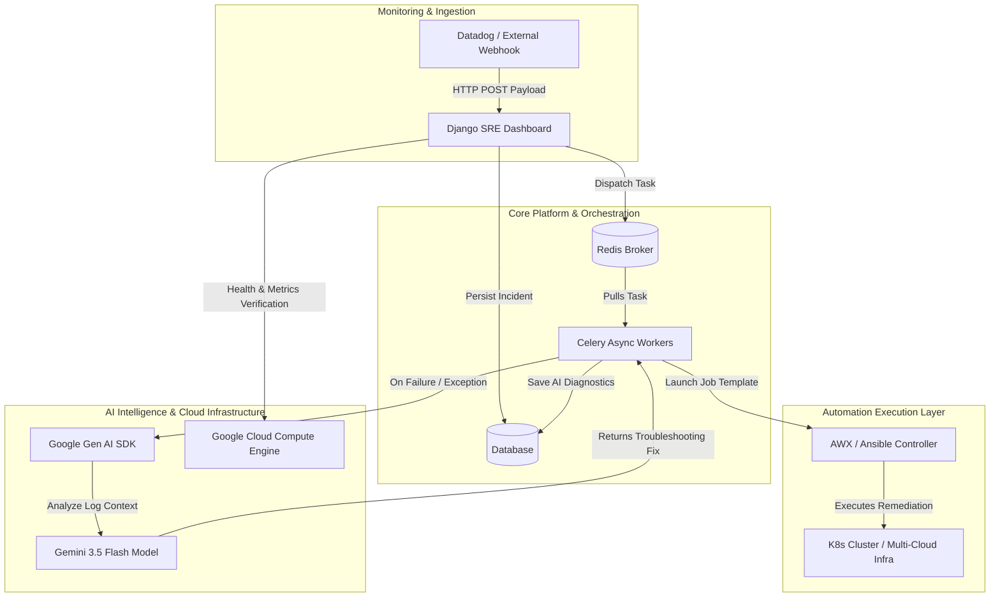

# 🚀 SRE Automation Platform with AWX & Gemini 3.5 AI

An enterprise-grade Site Reliability Engineering (SRE) automation dashboard designed to manage, trigger, and audit infrastructure workloads using **Django**, **Celery**, **AWX (Ansible Automation Controller)**, and **Google’s Gemini 3.5 Flash** for automated root-cause analysis.

---

## 🏗️ System Architecture



---

## 📋 Features & Functionality

- **Incident Orchestration Dashboard:** View active infrastructure alerts and trigger automated remediation playbooks with a single click.
- **Enterprise AWX Integration:** Programmatically interfaces with AWX job templates via secure bearer token authentication over Kubernetes NodePort.
- **AI-Powered Error Diagnostics:** Automatically intercepts automation failures (such as HTTP 401 token drops or connection timeouts) and queries **Gemini 3.5 Flash** via the official Google Gen AI SDK to instantly generate actionable troubleshooting steps.
- **Robust Background Processing:** Asynchronous execution using Celery backed by Redis message queues, managed via Linux systemd services.
- **Cloud Infrastructure Integration:** Interfaces with **Google Cloud Compute Engine (GCE)** for cloud resource metrics and infrastructure verification.

---

## 🛠️ Technologies Used

- **Backend Framework:** Python, Django 4.x/5.x
- **Task Queue & Broker:** Celery, Redis
- **Automation Controller:** AWX / Ansible (Running on Kubernetes / Minikube)
- **Artificial Intelligence:** Google Gen AI SDK (`google-genai`), **Gemini 3.5 Flash**
- **Cloud Infrastructure:** Google Cloud Compute Engine (GCE)
- **Frontend / UI:** Bootstrap 5, Responsive Design, CSS Text-Wrapping for Audit Logs

---

## ⚙️ Spin-up & Installation Instructions

Follow these steps to set up, configure, and run the platform locally or on a cloud server.

### Prerequisites
- Python 3.10+
- Redis Server (`sudo apt install redis-server`)
- An active AWX / Ansible Automation Controller instance
- A Google Gemini API Key

### 1. Clone the Repository
```bash
git clone [https://github.com/nitiya1919/django-awx-sre-dashboard.git](https://github.com/nitiya1919/django-awx-sre-dashboard.git)
cd django-awx-sre-dashboard
```

2. Set Up Virtual Environment & Dependencies
```bash
Bash
python3 -m venv venv
source venv/bin/activate
pip install --upgrade pip
pip install -r requirements.txt
```
(Ensure google-genai, celery, redis, and requests are installed).

4. Configure Environment Variables (.env)
Create a .env file in the project root:

```bash
# AWX Configuration
AWX_HOST=http://your-awx-server-ip:32000
AWX_TOKEN=your_bearer_token_here

# Google Gemini API Key
GEMINI_API_KEY=your_google_gemini_api_key_here

# Django Settings
SECRET_KEY=your_django_secret_key_here
DEBUG=True
ALLOWED_HOSTS=*

# Celery Broker Settings
CELERY_BROKER_URL=redis://127.0.0.1:6379/0
CELERY_RESULT_BACKEND=redis://127.0.0.1:6379/0
```

4. Run Database Migrations
```bash
Python
python3 manage.py makemigrations
python3 manage.py migrate
python3 manage.py createsuperuser
```
5. Run the Development Server
```bash
Bash
python3 manage.py runserver 0.0.0.0:8000
```
6. Start Celery Background Worker
In a separate terminal tab:
```bash
Bash
source venv/bin/activate
celery -A sre_platform worker --loglevel=info
```
## 🔍 Architecture & Data Flow
### User Action: 
The operator clicks Authorize and Run AWX on an incident card in the Django dashboard.

## Task Dispatch: 
Django queues a background job via Celery and Redis.

## Execution: 
The Celery worker invokes the AWX REST API to launch the targeted job template.

## AI Fallback: 
If the API returns an error code (e.g., 401 Unauthorized), the error payload is instantly routed to Gemini 3.5 Flash. The model analyzes the exception and formats a direct remediation tip.

## Auditing: 
The final status, job ID, and AI recommendation are written securely to the database and displayed cleanly in the real-time Audit Trail.

## 💡 Findings & Learnings
Robust Error Boundary Handling: Continuous automated runs exposed the need for aggressive string sanitization on bearer tokens (stripping trailing whitespace, newlines, and accidental quotes) to prevent false 401 headers.

## Asynchronous UI Stability: 
Decoupling AWX job triggers from the request-response cycle using Celery prevents UI thread hanging and allows users to manage multiple concurrent incident resolutions without request timeouts.
